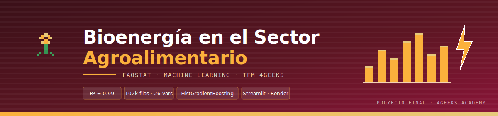

<p align="center">
  
</p>

# Proyecto Final 4Geeks · FAOSTAT

> Predicción del valor de bioenergía por país, año, ítem y tipo de medición usando datos públicos de FAOSTAT y técnicas de Machine Learning.

## Problema de negocio

El proyecto transforma datos públicos de FAOSTAT en una solución de Machine Learning para estimar el valor esperado de bioenergía por país, año, ítem y tipo de medición. La pregunta de negocio es:

> ¿Qué países, productos y condiciones históricas muestran mayor potencial de producción o uso de bioenergía dentro del sistema agroalimentario?

La fuente solicitada fue `https://www.fao.org/faostat/en/#data/AF`. En el catálogo oficial de FAOSTAT, `AF` corresponde a **Agricultural Science and Technology: ASTI - Researchers**. Como ese dominio tiene solo 3.800 filas, se usa como fuente obligatoria/contextual y se enriquece el modelo con dominios FAOSTAT relacionados para cumplir mejor los requisitos de volumen y variables:

- `AF`: ASTI - Researchers, fuente pedida.
- `AE`: ASTI - Expenditures, gasto en investigación agrícola.
- `CISP`: Country Investment Statistics Profile, contexto macro e inversión.
- `BE`: Bioenergy, tabla principal de modelado con más de 120.000 filas.

## Estructura

- `src/data_download.py`: descarga reproducible desde URLs bulk oficiales de FAOSTAT.
- `src/database.py`: almacena tablas en SQLite y ejecuta consultas `SELECT`, `JOIN` e `INSERT`.
- `src/features.py`: construye el dataset final, lags temporales y variables predictoras.
- `src/eda.py`: análisis descriptivo y gráficos.
- `src/train_model.py`: entrenamiento, validación temporal y optimización de hiperparámetros.
- `src/app.py`: aplicación web Streamlit para usar el modelo.
- `web/`: dashboard React (faolab) con sección Arcade — videojuego pixel-art educativo.
- `notebooks/explore.ipynb`: notebook de entrega con el flujo explicado.
- `presentation/pitch_5_minutos.md`: guion de presentación.

## Cómo ejecutarlo

```bash
cd "Proyecto Final 4geeks"
python3 -m venv venv
source venv/bin/activate
pip install -r requirements.txt
python src/run_pipeline.py
streamlit run src/app.py
```

Para previsualizar el dashboard `faolab` con el videojuego:

```bash
cd web && python -m http.server 8502
# Abre http://localhost:8502/faolab.html
```

## Entrega por fases

1. Definición del problema: predicción del valor de bioenergía con contexto de investigación e inversión agrícola.
2. Obtención de datos: descarga automática desde FAOSTAT bulk downloads.
3. Almacenamiento: SQLite en `data/database/faostat_project.db`.
4. Análisis descriptivo: estadísticas en `data/processed/descriptive_statistics.csv` y resumen en `eda_summary.json`.
5. EDA: gráficos en `reports/figures/` y partición temporal train/test.
6. Modelo: `HistGradientBoostingRegressor` con búsqueda de hiperparámetros y métricas guardadas.
7. Despliegue: app Streamlit lista para Render con `render.yaml`.

## Resultado del pipeline ejecutado

- Dataset final: 101.995 filas × 29 columnas.
- Predictores usados por el modelo: 26.
- Partición: 84.749 filas train y 17.246 filas test.
- Modelo final: `HistGradientBoostingRegressor`.
- Mejores hiperparámetros: `learning_rate=0.08`, `max_iter=140`, `max_leaf_nodes=31`.
- Métricas: MAE `60.528`, RMSE `641.472`, R² sobre objetivo logarítmico `0.990`.

## Fuentes

- FAOSTAT: https://www.fao.org/faostat/en/#data
- Catálogo bulk FAOSTAT: https://bulks-faostat.fao.org/production/datasets_E.json
- Dataset AF: https://bulks-faostat.fao.org/production/ASTI_Researchers_E_All_Data_(Normalized).zip
